# Ignite Health - System Architecture

## High-Level Architecture

## Data Flow: Refill Review

## Component Responsibilities

### Deterministic Components (NO AI)

| Component | Responsibility | Why Deterministic |
|-----------|---------------|-------------------|
| **PDC Calculator** | Calculate adherence scores | HEDIS compliance requires exact formula |
| **Drug Interaction Checker** | Identify drug-drug interactions | Patient safety - must be 100% reliable |
| **Lab Alert System** | Flag abnormal lab values | Critical thresholds must be exact |
| **Formulary Checker** | Verify insurance coverage | Binary yes/no decision |
| **Data Validation** | Validate FHIR resources | Schema enforcement |

### AI-Enhanced Components

| Component | Responsibility | Why AI |
|-----------|---------------|--------|
| **Risk Stratification** | Predict non-adherence risk | Pattern recognition across many factors |
| **Clinical Reasoning** | Explain recommendations | Natural language generation |
| **Trend Analysis** | Identify concerning patterns | Multi-factor correlation |
| **Patient Communication** | Draft outreach messages | Personalized, empathetic language |

## Confidence Routing Architecture

```mermaid
flowchart TD
    START[AI Generates Recommendation] --> SC[Self-Consistency Check<br/>5 samples]
    SC --> CM[Checker Model<br/>Validates Output]
    CM --> HD[Hallucination Detection]
    HD --> CONF[Calculate Overall Confidence]
    
    CONF --> HIGH{Confidence >= 95%}
    HIGH -->|Yes| REC1[✓ Recommend<br/>Minimal Review]
    HIGH -->|No| STD{Confidence >= 85%}
    
    STD -->|Yes| REC2[⚠ Recommend<br/>Standard Review]
    STD -->|No| ENH{Confidence >= 70%}
    
    ENH -->|Yes| REC3[⚠ Recommend<br/>Enhanced Review]
    ENH -->|No| ESC[🔴 Escalate<br/>Pharmacist Review]
    
    REC1 --> SAFETY{Safety Issues?}
    REC2 --> SAFETY
    REC3 --> SAFETY
    
    SAFETY -->|Yes| ESC
    SAFETY -->|No| QUEUE[Add to Review Queue]
```

## FHIR Resource Model

## Security Architecture

## Deployment Architecture

## Key Design Decisions

### 1. Why Medplum?

| Alternative | Why Not | Medplum Advantage |
|-------------|---------|-------------------|
| Build from scratch | 6-12 months, $300K+ | Day 1 FHIR compliance |
| Firestore + custom | No FHIR, no HIPAA | Native FHIR, BAA available |
| AWS HealthLake | Expensive, limited features | Open source, flexible |
| Epic/Cerner | Vendor lock-in, high cost | Control, cost-effective |

### 2. Why Hybrid AI Architecture?

- **Safety-critical = Deterministic**: Drug interactions, lab alerts, PDC
- **Pattern recognition = AI**: Risk stratification, recommendations
- **Never trust AI alone**: Multi-stage verification mandatory

### 3. Why Multi-Stage Verification?

Research shows single-model systems have 3x higher error rates for clinical decisions. Our approach:
1. **Self-consistency**: 5 samples, majority vote
2. **Checker model**: Separate model validates
3. **Hallucination detection**: Pattern matching
4. **Confidence scoring**: Multi-factor calculation
5. **Human routing**: Low confidence = escalate

### 4. Why Not Fine-tuning Initially?

- Insufficient proprietary data (need 6-12 months of outcomes)
- Prompt engineering + RAG achieves 85%+ accuracy
- Fine-tuning adds complexity and training overhead
- Plan to fine-tune after collecting outcome data

## Performance Targets

| Metric | Target | Rationale |
|--------|--------|-----------|
| Queue load time | < 2s | Clinician productivity |
| AI recommendation | < 30s | Acceptable wait during batch |
| PDC calculation | < 100ms | Must be fast for batch |
| Daily batch processing | < 2 hours | Complete before morning shift |
| System uptime | 99.9% | Clinical dependency |
| AI precision | > 95% | Clinical safety |
| False positive rate | < 5% | Avoid alert fatigue |
