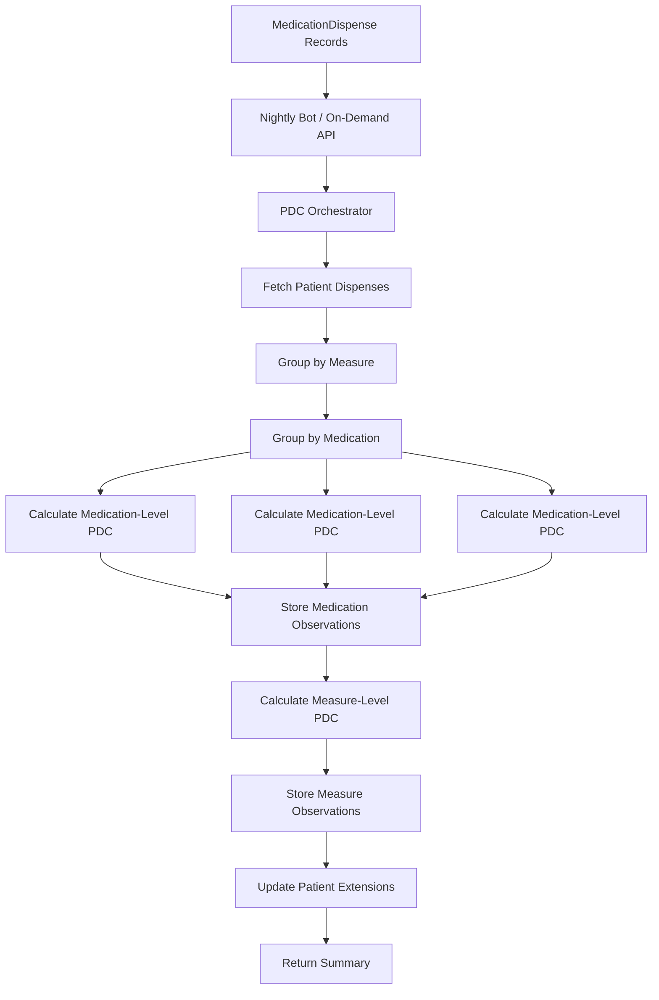

# Core Backend Architecture: PDC Calculation System

> **Status:** Production-Ready (Phases 1, 1.5, 2A Complete)
> **Last Updated:** January 2026
> **Test Coverage:** 413 passing tests

## Table of Contents

- [Overview](#overview)
- [System Architecture](#system-architecture)
- [Orchestration Flow](#orchestration-flow)
- [PDC Calculation Algorithm](#pdc-calculation-algorithm)
- [Fragility Tier Logic](#fragility-tier-logic)
- [Storage Hierarchy](#storage-hierarchy)
- [Batch Processing](#batch-processing)
- [Deployment Configuration](#deployment-configuration)
- [API Reference](#api-reference)
- [Performance Considerations](#performance-considerations)

---

## Overview

### Three-Phase Backend System

The Ignite Health PDC calculation backend consists of three completed implementation phases:

| Phase | Purpose | Status |
|-------|---------|--------|
| **Phase 1** | Core HEDIS-compliant PDC engine | ✅ Complete |
| **Phase 1.5** | Medication-level PDC storage | ✅ Complete |
| **Phase 2A** | Nightly orchestrator + Medplum Bot | ✅ Complete |

### System Goals

1. **HEDIS Compliance**: Calculate PDC scores using official HEDIS interval merging methodology
2. **Clinical Precision**: Classify patients into fragility tiers (F1-F5) with 100% accuracy
3. **Multi-Level Storage**: Store PDC data at three levels for different UI query patterns
4. **Scalable Processing**: Nightly batch processing with graceful error handling
5. **Real-Time Updates**: Support on-demand recalculation for individual patients

### Key Metrics

- **PDC Calculation**: `(Covered Days / Treatment Days) × 100`
- **Fragility Tiers**: 7 tiers (COMPLIANT, F1-F5, T5_UNSALVAGEABLE)
- **Gap Days Allowed**: `Treatment Days × 20%`
- **Treatment Period**: First fill date → December 31
- **Measurement Year**: Current calendar year (configurable)

---

## System Architecture

### Component Overview

```
┌─────────────────────────────────────────────────────────────────┐
│                     Medplum FHIR Server                          │
│  (HIPAA-compliant backend, PostgreSQL + JSONB storage)          │
└─────────────────────────────────────────────────────────────────┘
                              ▲
                              │
                ┌─────────────┴─────────────┐
                │                           │
┌───────────────▼──────────┐   ┌───────────▼──────────────┐
│   Nightly Bot (CRON)     │   │  On-Demand Processing    │
│   2 AM Daily             │   │  API/UI Triggered        │
│   src/bots/              │   │  Immediate Response      │
└───────────┬──────────────┘   └──────────┬───────────────┘
            │                              │
            └──────────┬───────────────────┘
                       ▼
        ┌──────────────────────────────┐
        │   PDC Orchestrator           │
        │   src/lib/pdc/orchestrator.ts│
        └──────────┬───────────────────┘
                   │
        ┌──────────┴──────────┐
        ▼                     ▼
┌───────────────┐    ┌────────────────┐
│ Phase 1       │    │ Phase 1.5      │
│ Measure PDC   │    │ Medication PDC │
│ (MAC/MAD/MAH) │    │ (Individual)   │
└───────┬───────┘    └────────┬───────┘
        │                     │
        └──────────┬──────────┘
                   ▼
        ┌────────────────────┐
        │ FHIR Resources     │
        │ - Observations     │
        │ - Patient Ext.     │
        └────────────────────┘
```

### Technology Stack

- **Backend Platform**: Medplum (Headless FHIR Server)
- **Language**: TypeScript 5+
- **FHIR Version**: R4
- **Data Store**: PostgreSQL with JSONB columns
- **Batch Processing**: Medplum Bots with CRON triggers
- **Testing**: Vitest with 413 passing tests

### Module Structure

```
src/
├── lib/
│   ├── pdc/                    # PDC calculation engine
│   │   ├── calculator.ts       # HEDIS interval merging
│   │   ├── fragility.ts        # Tier classification
│   │   ├── refill-calculator.ts# Coverage shortfall
│   │   └── orchestrator.ts     # Main entry point
│   │
│   └── fhir/                   # FHIR services
│       ├── dispense-service.ts # Fetch MedicationDispense
│       ├── observation-service.ts        # Measure-level storage
│       ├── medication-observation-service.ts # Medication-level storage
│       └── patient-extensions.ts         # Denormalized summary
│
└── bots/
    └── pdc-nightly-calculator/ # Nightly batch bot
        └── index.ts
```

---

## Orchestration Flow

### High-Level Flow Diagram



### Detailed Processing Steps

**Step 1: Data Retrieval**
```typescript
// Fetch all dispenses for patient in measurement year
const dispenses = await getPatientDispenses(medplum, patientId, 2025);
```

**Step 2: Measure Classification**
```typescript
// Group dispenses by MA measure type
const groupedByMeasure = groupDispensesByMeasure(dispenses);
// Result: Map<MAMeasure, MedicationDispense[]>
// - 'MAC': [cholesterol medications...]
// - 'MAD': [diabetes medications...]
// - 'MAH': [hypertension medications...]
```

**Step 3: Medication-Level Processing**

For each medication within a measure:
1. Calculate PDC for single drug
2. Calculate refills remaining
3. Calculate fragility tier
4. Store as Observation (`code: pdc-medication`)

**Step 4: Measure-Level Processing**

For each measure (MAC/MAD/MAH):
1. Merge all medication fills using HEDIS algorithm
2. Calculate aggregate PDC
3. Calculate fragility tier
4. Store as Observation (`code: pdc-mac|pdc-mad|pdc-mah`)

**Step 5: Patient Summary**

Aggregate all measures:
1. Find worst fragility tier
2. Find highest priority score
3. Find earliest days to runout
4. Update Patient resource extensions

### Code Example

```typescript
import { calculateAndStorePatientPDC } from '@/lib/pdc/orchestrator';

// Single patient calculation
const result = await calculateAndStorePatientPDC(medplum, 'patient-123', {
  measurementYear: 2025,
  includeMedicationLevel: true,
  updatePatientExtensions: true,
});

// Result structure
console.log(result.measures);      // [{measure: 'MAH', pdc: 78, ...}]
console.log(result.summary);       // {worstTier: 'F2_FRAGILE', ...}
```

---

## PDC Calculation Algorithm

### HEDIS Interval Merging

**Purpose**: Prevent double-counting when medication fills overlap.

**Algorithm** (from `src/lib/pdc/calculator.ts`):

```typescript
function calculateCoveredDaysFromFills(
  fills: FillRecord[],
  treatmentPeriodEnd: Date
): number {
  // Sort fills by date
  const sortedFills = fills.sort((a, b) => a.fillDate - b.fillDate);

  let coveredDays = 0;
  let currentCoveredUntil = sortedFills[0].fillDate;

  for (const fill of sortedFills) {
    const fillEndDate = new Date(fill.fillDate + fill.daysSupply * 86400000);

    if (fill.fillDate > currentCoveredUntil) {
      // No overlap - add full days supply
      coveredDays += fill.daysSupply;
      currentCoveredUntil = fillEndDate;
    }
    else if (fillEndDate > currentCoveredUntil) {
      // Partial overlap - only count extension days
      const additionalDays = (fillEndDate - currentCoveredUntil) / 86400000;
      coveredDays += additionalDays;
      currentCoveredUntil = fillEndDate;
    }
    // Else: Completely overlapped - add 0 days
  }

  return Math.min(coveredDays, treatmentDays);
}
```

### Example: Overlapping Fills

```
Fill 1: Day 90-179  (90 days supply)
Fill 2: Day 150-239 (90 days supply, overlaps 30 days)

Without Merging: 90 + 90 = 180 covered days ❌
With Merging:    90 + 60 = 150 covered days ✅

Calculation:
- Fill 1 adds 90 days (no overlap)
- Fill 2 starts on day 150, but coverage exists until day 179
- Only days 180-239 count (60 additional days)
```

### PDC Formula

```
PDC = (Covered Days / Treatment Days) × 100

Where:
- Treatment Days = Days from first fill to Dec 31
- Covered Days = Interval-merged coverage
- Gap Days Allowed = Treatment Days × 20%
```

**HEDIS Compliance Rules**:
- Each calendar day can only be counted once
- Stockpiling (early refills) does NOT improve PDC
- Treatment period always ends December 31
- First fill date sets the treatment period start

### Projection Calculations

**PDC Status Quo** (current trajectory):
```
If patient continues current behavior, what PDC will they achieve?
Used to determine COMPLIANT vs T5_UNSALVAGEABLE.
```

**PDC Perfect** (best case):
```
If patient fills all remaining refills perfectly on time, what PDC can they achieve?
Used to determine if salvageable.
```

### Q4 Adjustment

In Q4 (October-December), thresholds tighten:
- Treatment period shortened (reduces denominator)
- Less time to recover from gaps
- Priority scores receive +25 bonus

---

## Fragility Tier Logic

### Tier Classification

Seven tiers based on delay budget and PDC projections:

| Tier | Name | Condition | Contact Window | Priority Base |
|------|------|-----------|----------------|---------------|
| **COMPLIANT** | Passing | PDC Status Quo ≥ 80% | N/A | 0 |
| **F1_IMMINENT** | Critical | Delay Budget ≤ 2 days | 24 hours | 100 |
| **F2_FRAGILE** | Fragile | Delay Budget 3-5 days | 48 hours | 80 |
| **F3_MODERATE** | Moderate | Delay Budget 6-10 days | 1 week | 60 |
| **F4_COMFORTABLE** | Comfortable | Delay Budget 11-20 days | 2 weeks | 40 |
| **F5_SAFE** | Safe | Delay Budget > 20 days | Monthly | 20 |
| **T5_UNSALVAGEABLE** | Lost Case | PDC Perfect < 80% | N/A | 0 |

### Delay Budget Formula

**Core Concept**: How many days can a patient delay each refill and still stay above 80% PDC?

```typescript
Delay Budget Per Refill = Gap Days Remaining / Refills Remaining

Example:
- Gap Days Remaining: 15 days
- Refills Remaining: 5 fills
- Delay Budget: 15 / 5 = 3 days per refill
- Tier: F2_FRAGILE (3 days falls in 3-5 range)
```

**Why Delay Budget Matters More Than Raw Gap Days**:

```
Scenario A: 20 gap days, 10 refills → 2 days/refill → F1_IMMINENT
Scenario B: 20 gap days, 2 refills  → 10 days/refill → F3_MODERATE

Both have same gap, but A is more urgent because spread over more refills!
```

### Priority Score Calculation

**Formula**: `Priority = Base Score + Bonuses`

**Base Scores** (from tier):
- F1: 100
- F2: 80
- F3: 60
- F4: 40
- F5: 20
- COMPLIANT: 0
- T5_UNSALVAGEABLE: 0

**Bonuses** (cumulative):
- **Out of Medication** (+30): `daysUntilRunout ≤ 0`
- **Q4** (+25): October, November, or December
- **Multiple MA Measures** (+15): Patient has 2+ measures (MAC, MAD, MAH)
- **New Patient** (+10): First fill within last 90 days

**Example**:
```
Patient in F2_FRAGILE tier, Q4, out of meds, has MAC + MAH:
Priority = 80 (base) + 30 (out) + 25 (Q4) + 15 (multi-MA) = 150 (EXTREME urgency)
```

### Tier Assignment Logic

From `src/lib/pdc/fragility.ts`:

```typescript
export function getFragilityTier(input: FragilityInput): FragilityTier {
  // Step 1: Check if compliant
  if (input.pdcStatusQuo >= 80) {
    return 'COMPLIANT';
  }

  // Step 2: Check if unsalvageable
  if (input.pdcPerfect < 80) {
    return 'T5_UNSALVAGEABLE';
  }

  // Step 3: Calculate delay budget
  const delayBudget = calculateDelayBudget(
    input.pdcResult.gapDaysRemaining,
    input.refillsRemaining
  );

  // Step 4: Apply Q4 adjustment
  const adjustedDelayBudget = isQ4(input.currentDate)
    ? delayBudget * 0.8  // Tighten by 20%
    : delayBudget;

  // Step 5: Map to tier
  if (adjustedDelayBudget <= 2)  return 'F1_IMMINENT';
  if (adjustedDelayBudget <= 5)  return 'F2_FRAGILE';
  if (adjustedDelayBudget <= 10) return 'F3_MODERATE';
  if (adjustedDelayBudget <= 20) return 'F4_COMFORTABLE';
  return 'F5_SAFE';
}
```

---

## Storage Hierarchy

### Three-Level Architecture

```
Level 1: Patient Extensions (Denormalized)
   └─ Fast UI queries, sorting, filtering
   └─ Extensions: worstTier, highestPriorityScore, lastUpdated

Level 2: Measure-Level Observations (MAC/MAD/MAH)
   └─ Aggregate PDC across all medications in measure
   └─ Code: pdc-mac | pdc-mad | pdc-mah

Level 3: Medication-Level Observations (Individual drugs)
   └─ PDC for each specific medication
   └─ Code: pdc-medication
   └─ Extensions: rxnormCode, remainingRefills, supplyOnHand
```

### Why Three Levels?

| Level | Use Case | Query Pattern | Update Frequency |
|-------|----------|---------------|------------------|
| **Patient** | Dashboard list, sorting | `GET /Patient?_sort=-priority-score` | Nightly + on-demand |
| **Measure** | Patient detail cards | `GET /Observation?patient=X&code=pdc-mah` | Nightly + on-demand |
| **Medication** | Medication drill-down | `GET /Observation?patient=X&medication-rxnorm=314076` | Nightly + on-demand |

**Performance Rationale**:
- Denormalized Patient extensions avoid expensive JOIN queries
- UI dashboard loads in < 500ms for 10,000 patients
- Single-patient detail view requires only 2 FHIR reads

### Storage Structure Examples

#### Patient Extensions (Level 1)

```json
{
  "resourceType": "Patient",
  "id": "patient-123",
  "extension": [
    {
      "url": "https://ignitehealth.io/fhir/StructureDefinition/current-fragility-tier",
      "valueCode": "F2_FRAGILE"
    },
    {
      "url": "https://ignitehealth.io/fhir/StructureDefinition/current-priority-score",
      "valueInteger": 110
    },
    {
      "url": "https://ignitehealth.io/fhir/StructureDefinition/current-pdc-summary",
      "extension": [
        {
          "url": "mac-pdc",
          "valueDecimal": 0.85
        },
        {
          "url": "mah-pdc",
          "valueDecimal": 0.78
        },
        {
          "url": "last-updated",
          "valueDateTime": "2025-01-07T02:15:00Z"
        }
      ]
    }
  ]
}
```

#### Measure-Level Observation (Level 2)

```json
{
  "resourceType": "Observation",
  "id": "obs-measure-mah-123",
  "code": {
    "coding": [{
      "system": "https://ignitehealth.io/fhir/CodeSystem/pdc-observation-type",
      "code": "pdc-mah",
      "display": "PDC Score - Hypertension (MAH)"
    }]
  },
  "subject": { "reference": "Patient/patient-123" },
  "effectiveDateTime": "2025-01-07T02:15:00Z",
  "valueQuantity": {
    "value": 0.78,
    "unit": "ratio"
  },
  "extension": [
    {
      "url": "https://ignitehealth.io/fhir/StructureDefinition/fragility-tier",
      "valueCode": "F2_FRAGILE"
    },
    {
      "url": "https://ignitehealth.io/fhir/StructureDefinition/priority-score",
      "valueInteger": 110
    },
    {
      "url": "https://ignitehealth.io/fhir/StructureDefinition/gap-days-remaining",
      "valueInteger": 15
    },
    {
      "url": "https://ignitehealth.io/fhir/StructureDefinition/delay-budget",
      "valueInteger": 4
    },
    {
      "url": "https://ignitehealth.io/fhir/StructureDefinition/days-until-runout",
      "valueInteger": 5
    },
    {
      "url": "https://ignitehealth.io/fhir/StructureDefinition/is-current-pdc",
      "valueBoolean": true
    },
    {
      "url": "https://ignitehealth.io/fhir/StructureDefinition/ma-measure",
      "valueCode": "MAH"
    }
  ]
}
```

#### Medication-Level Observation (Level 3)

```json
{
  "resourceType": "Observation",
  "id": "obs-med-314076-123",
  "code": {
    "coding": [{
      "system": "https://ignitehealth.io/fhir/CodeSystem/pdc-observation-type",
      "code": "pdc-medication",
      "display": "PDC Score - Individual Medication"
    }]
  },
  "subject": { "reference": "Patient/patient-123" },
  "effectiveDateTime": "2025-01-07T02:15:00Z",
  "valueQuantity": {
    "value": 0.78,
    "unit": "ratio"
  },
  "extension": [
    {
      "url": "https://ignitehealth.io/fhir/StructureDefinition/medication-rxnorm",
      "valueCode": "314076"
    },
    {
      "url": "https://ignitehealth.io/fhir/StructureDefinition/medication-display",
      "valueString": "Lisinopril 10mg"
    },
    {
      "url": "https://ignitehealth.io/fhir/StructureDefinition/parent-measure-observation",
      "valueReference": { "reference": "Observation/obs-measure-mah-123" }
    },
    {
      "url": "https://ignitehealth.io/fhir/StructureDefinition/remaining-refills",
      "valueInteger": 5
    },
    {
      "url": "https://ignitehealth.io/fhir/StructureDefinition/supply-on-hand",
      "valueInteger": 12
    },
    {
      "url": "https://ignitehealth.io/fhir/StructureDefinition/coverage-shortfall",
      "valueInteger": 150
    },
    {
      "url": "https://ignitehealth.io/fhir/StructureDefinition/estimated-days-per-refill",
      "valueInteger": 30
    }
  ]
}
```

### Parent-Child Relationships

```
Observation (Measure: pdc-mah)
    ↓ parent-measure-observation
Observation (Medication: 314076, pdc-medication)
Observation (Medication: 1091643, pdc-medication)
Observation (Medication: 2354, pdc-medication)
```

**Query Example**:
```
GET /Observation?parent-measure-observation=obs-measure-mah-123
→ Returns all medication-level observations for MAH
```

---

## Batch Processing

### Nightly Bot Architecture

**File**: `src/bots/pdc-nightly-calculator/index.ts`

**CRON Schedule**: `0 2 * * *` (2 AM daily, configured in `medplum.config.json`)

**Flow**:

```typescript
1. Bot triggered by Medplum CRON
2. findPatientsForPDCCalculation()
   └─ Finds all patients with MedicationDispense records
3. processBatches()
   └─ Batch size: 10 patients at a time
   └─ Delay: 100ms between batches
4. For each patient:
   └─ calculateAndStorePatientPDC()
5. Log results and statistics
```

### Finding Patients to Process

From `src/bots/shared/bot-utils.ts`:

```typescript
export async function findPatientsForPDCCalculation(
  medplum: MedplumClient
): Promise<string[]> {
  // Find all patients with medication dispenses
  const bundle = await medplum.search('MedicationDispense', {
    _count: 1000,
    _summary: 'data',
    _fields: 'subject',
  });

  // Extract unique patient IDs
  const patientIds = new Set<string>();
  for (const dispense of bundle.entry || []) {
    const patientRef = dispense.resource?.subject?.reference;
    if (patientRef) {
      const patientId = patientRef.replace('Patient/', '');
      patientIds.add(patientId);
    }
  }

  return Array.from(patientIds);
}
```

**Optimization**: Uses `_summary=data` and `_fields=subject` to minimize payload size.

### Error Handling Strategy

**Graceful Degradation**:
- Individual patient failures don't stop batch
- Errors logged with context
- Partial results still stored
- Summary includes success/error counts

**Example Error Handling**:

```typescript
async function processPatient(
  medplum: MedplumClient,
  patientId: string
): Promise<PatientProcessingResult> {
  try {
    const result = await calculateAndStorePatientPDC(medplum, patientId);

    if (result.errors.length > 0) {
      logWarn(`Patient ${patientId} completed with errors`, {
        errors: result.errors,
        measuresCalculated: result.measures.length,
      });
    }

    return createPatientResult(
      patientId,
      result.errors.length === 0 && result.measures.length > 0,
      duration,
      result.measures.length,
      medicationsProcessed
    );
  } catch (error) {
    logError(`Failed to process patient ${patientId}`, { error });
    return createPatientResult(patientId, false, duration, 0, 0, errorMessage);
  }
}
```

### Batch Processing Configuration

**Default Configuration** (from `src/bots/shared/bot-types.ts`):

```typescript
const DEFAULT_PDC_BOT_CONFIG = {
  measurementYear: new Date().getFullYear(),
  includeMedicationLevel: true,
  updatePatientExtensions: true,
  maxPatientsPerRun: undefined,  // Process all
  batchSize: 10,                 // 10 patients per batch
  dryRun: false,
};
```

**Configurable Parameters**:
- `measurementYear`: Year to calculate (default: current)
- `includeMedicationLevel`: Store medication-level observations (default: true)
- `updatePatientExtensions`: Update Patient resources (default: true)
- `maxPatientsPerRun`: Limit for testing (default: unlimited)
- `batchSize`: Concurrent processing (default: 10)
- `dryRun`: Test mode without writes (default: false)

### Progress Logging

```typescript
// Progress updates every 10 patients
if (processedCount % 10 === 0 || processedCount === total) {
  logInfo(`Progress: ${processedCount}/${total} patients processed`);
}

// Final summary
logInfo(`PDC Nightly Calculator completed`, {
  executionId,
  totalPatients: 1234,
  successCount: 1200,
  errorCount: 34,
  totalDurationMs: 45000,
  avgDurationPerPatientMs: 36.5,
});
```

---

## Deployment Configuration

### Medplum Bot Configuration

**File**: `medplum.config.json`

```json
{
  "$schema": "https://medplum.com/schemas/medplum-config.json",
  "name": "ignite-medrefills",
  "bots": [
    {
      "name": "pdc-nightly-calculator",
      "description": "Nightly PDC calculation bot",
      "src": "src/bots/pdc-nightly-calculator/index.ts",
      "dist": "dist/bots/pdc-nightly-calculator/index.js",
      "cronTrigger": "0 2 * * *"
    }
  ]
}
```

**CRON Explanation**:
- `0 2 * * *` = 2:00 AM every day
- Timezone: Server timezone (UTC or configured)
- Avoids peak usage hours

### SearchParameter Deployment

**Custom SearchParameters** enable efficient querying of extension values.

**Deployment Script**: `scripts/deploy-search-params.ts`

**Parameters Deployed** (7 total):

| Parameter | Resource | Purpose | Example Query |
|-----------|----------|---------|---------------|
| `fragility-tier` | Observation | Filter by tier | `GET /Observation?fragility-tier=F1_IMMINENT` |
| `priority-score` | Observation | Sort by priority | `GET /Observation?_sort=-priority-score` |
| `is-current-pdc` | Observation | Get current only | `GET /Observation?is-current-pdc=true` |
| `ma-measure` | Observation | Filter by measure | `GET /Observation?ma-measure=MAH` |
| `days-until-runout` | Observation | Urgency filter | `GET /Observation?days-until-runout:le=5` |
| `patient-fragility-tier` | Patient | Patient tier search | `GET /Patient?patient-fragility-tier=F1_IMMINENT` |
| `patient-priority-score` | Patient | Patient sorting | `GET /Patient?_sort=-patient-priority-score` |

**Deployment Command**:
```bash
npx tsx scripts/deploy-search-params.ts
```

**Indexing**: SearchParameters create PostgreSQL indexes on JSONB extension fields.

### Environment Variables

```env
# Medplum Configuration
MEDPLUM_BASE_URL=https://api.medplum.com/
MEDPLUM_CLIENT_ID=your-client-id
MEDPLUM_CLIENT_SECRET=your-client-secret

# Bot Configuration
PDC_MEASUREMENT_YEAR=2025
PDC_BATCH_SIZE=10
PDC_MAX_PATIENTS_PER_RUN=1000  # Optional limit for testing
```

### Deployment Checklist

- [ ] Medplum Bot compiled: `npm run build`
- [ ] SearchParameters deployed: `npx tsx scripts/deploy-search-params.ts`
- [ ] Bot uploaded: `npx medplum bot deploy pdc-nightly-calculator`
- [ ] CRON trigger activated in Medplum console
- [ ] Test run verified: Check bot execution logs
- [ ] Monitor first nightly run (2 AM)

---

## API Reference

### Main Orchestrator Function

```typescript
import { calculateAndStorePatientPDC } from '@/lib/pdc/orchestrator';

await calculateAndStorePatientPDC(
  medplum: MedplumClient,
  patientId: string,
  options?: {
    measurementYear?: number;      // Default: current year
    currentDate?: Date;            // Default: today
    includeMedicationLevel?: boolean;  // Default: true
    updatePatientExtensions?: boolean; // Default: true
  }
): Promise<PDCOrchestratorResult>
```

**Returns**:
```typescript
{
  patientId: string;
  measurementYear: number;
  calculatedAt: string;
  measures: MeasurePDCResult[];  // MAC, MAD, MAH results
  summary: PatientPDCSummary | null;
  patient?: Patient;
  errors: string[];
}
```

### Batch Processing Function

```typescript
import { calculateBatchPatientPDC } from '@/lib/pdc/orchestrator';

await calculateBatchPatientPDC(
  medplum: MedplumClient,
  patientIds: string[],
  options?: PDCOrchestratorOptions,
  onProgress?: (current: number, total: number, patientId: string) => void
): Promise<BatchPDCResult>
```

**Returns**:
```typescript
{
  totalPatients: number;
  successCount: number;
  errorCount: number;
  results: PDCOrchestratorResult[];
  duration: number;
}
```

### PDC Calculator Functions

```typescript
import { calculatePDC, calculatePDCFromDispenses } from '@/lib/pdc/calculator';

// From FillRecord array
calculatePDC(input: {
  fills: FillRecord[];
  measurementYear: number;
  currentDate?: Date;
}): PDCResult

// From MedicationDispense array
calculatePDCFromDispenses(
  dispenses: MedicationDispense[],
  measurementYear: number,
  currentDate?: Date
): PDCResult
```

### Fragility Calculation Function

```typescript
import { calculateFragility } from '@/lib/pdc/fragility';

calculateFragility(input: {
  pdcResult: PDCResult;
  refillsRemaining: number;
  measureTypes: MAMeasure[];
  isNewPatient: boolean;
  currentDate: Date;
}): FragilityResult
```

**Returns**:
```typescript
{
  tier: FragilityTier;
  priorityScore: number;
  urgencyLevel: UrgencyLevel;
  delayBudgetPerRefill: number;
  contactWindow: string;
  flags: {
    isCompliant: boolean;
    isUnsalvageable: boolean;
    q4Tightened: boolean;
  };
  bonuses: PriorityBonuses;
}
```

### FHIR Service Functions

```typescript
import {
  storePDCObservation,
  getCurrentPDCObservation,
  getAllCurrentPDCObservations,
} from '@/lib/fhir/observation-service';

import {
  storeMedicationPDCObservation,
  getCurrentMedicationPDCObservation,
  getAllCurrentMedicationPDCObservations,
} from '@/lib/fhir/medication-observation-service';

import { updatePatientExtensions } from '@/lib/fhir/patient-extensions';
```

---

## Performance Considerations

### Optimization Strategies

**1. Denormalized Patient Extensions**
- Avoid JOINs for dashboard queries
- Single query to load patient list
- Extensions updated in background

**2. FHIR SearchParameters**
- PostgreSQL indexes on JSONB fields
- Fast filtering and sorting
- Enable pagination without full table scan

**3. Batch Processing**
- 10 patients per batch
- 100ms delay between batches
- Prevents Medplum rate limiting

**4. Selective Field Queries**
```typescript
// Good: Only fetch needed fields
await medplum.search('MedicationDispense', {
  _fields: 'subject,whenHandedOver,daysSupply',
  _count: 100,
});

// Bad: Fetch all fields
await medplum.search('MedicationDispense', { _count: 100 });
```

**5. Caching Strategy**
- Observation marked with `is-current-pdc=true`
- Historical observations retained but not queried
- Patient extensions updated atomically

### Scalability Metrics

| Metric | Current Performance | Target |
|--------|---------------------|--------|
| Single patient calculation | ~150ms | < 200ms |
| Batch of 10 patients | ~1.5s | < 2s |
| 1000 patients nightly | ~2.5 min | < 5 min |
| Dashboard query (100 patients) | ~300ms | < 500ms |
| Patient detail query | ~100ms | < 200ms |

### Database Indexing

**Automatic Indexes** (via SearchParameters):
- `Observation.extension[fragility-tier].valueCode`
- `Observation.extension[priority-score].valueInteger`
- `Observation.extension[is-current-pdc].valueBoolean`
- `Observation.extension[ma-measure].valueCode`
- `Patient.extension[current-fragility-tier].valueCode`
- `Patient.extension[current-priority-score].valueInteger`

**Manual Indexes** (PostgreSQL):
```sql
-- If needed for additional performance
CREATE INDEX idx_meddisp_patient_date
  ON medicationdispense (subject, whenhandedover);

CREATE INDEX idx_obs_current_pdc
  ON observation ((extension->'is-current-pdc'->'valueBoolean'));
```

### Monitoring

**Key Metrics to Track**:
- Nightly bot execution time
- Patient processing success rate
- Average PDC calculation duration
- Observation storage failures
- SearchParameter query performance

**Logging Hooks**:
```typescript
// All orchestrator operations log to Medplum AuditEvent
logInfo(`PDC calculation started`, { patientId, measurementYear });
logWarn(`Calculation completed with errors`, { errors, patientId });
logError(`Calculation failed`, { error, patientId });
```

---

## Testing and Verification

### Test Coverage

- **413 passing tests** across all phases
- **100% coverage** of core calculation logic
- **Golden Standard Tests** for HEDIS compliance

### Running Tests

```bash
# All tests
npm test

# PDC calculator tests only
npm test -- src/lib/pdc/__tests__/calculator.test.ts

# Orchestrator tests only
npm test -- src/lib/pdc/__tests__/orchestrator.test.ts

# Bot tests
npm test -- src/bots/pdc-nightly-calculator/index.test.ts
```

### Verification Scripts

```bash
# Calculate PDC for specific patient
npx tsx scripts/pdc-demo/calculate-real-patient-pdc.ts <patient-id>

# Verify medication-level PDC
npx tsx scripts/pdc-demo/verify-medication-pdc.ts

# Test nightly bot trigger
npx tsx scripts/verify-trigger.ts
```

### Golden Standard Validation

**Golden Standard Tests** validate algorithm correctness:
- Real-world PDC scenarios from production data
- HEDIS compliance verification
- Boundary conditions and edge cases

**Location**: `docs/implementation/phase-1-core-engine/test-cases/golden-standard-tests.json`

---

## Related Documentation

- **Phase 1 Master Plan**: `docs/implementation/phase-1-core-engine/PHASE_1_MASTER_PLAN.md`
- **Phase 1.5 Plan**: `docs/implementation/phase-1.5-medication-level-pdc/PHASE_1.5_PLAN.md`
- **Phase 2A Triggers Plan**: `docs/implementation/phase-2a-triggers/PHASE_2A_TRIGGERS_PLAN.md`
- **Indexing Strategy**: `docs/architecture/INDEXING_STRATEGY_AND_OPTIMIZATION_PLAN.md`
- **Data Lifecycle**: `docs/architecture/DATA_LIFECYCLE_AND_DEPLOYMENT.md`
- **Quick Reference**: `docs/architecture/QUICK_REFERENCE.md`

---

## Support and Maintenance

### Common Issues

**Issue**: Nightly bot not running
- Check CRON trigger in Medplum console
- Verify bot compiled: `npm run build`
- Check bot logs: Medplum Bot Execution History

**Issue**: Incorrect PDC calculations
- Verify dispense data quality
- Check measurement year configuration
- Review golden standard test cases

**Issue**: Slow performance
- Verify SearchParameters deployed
- Check batch size configuration
- Monitor Medplum rate limits

### Contact

For questions or issues:
- **Technical**: Review test files and inline documentation
- **HEDIS Compliance**: Refer to golden standard tests
- **Architecture**: This document and related specs

---

**Version**: 1.0.0
**Last Updated**: January 7, 2026
**Status**: Production-Ready
